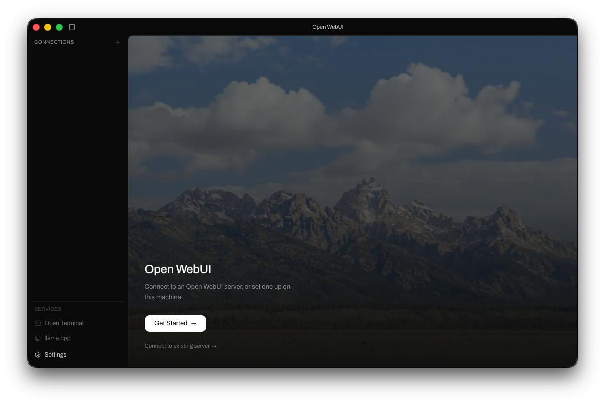

# AuraPro Desktop

[English](README.md) | **简体中文**

[](https://github.com/AuraPro-Official/AuraPro-Desktop/releases)
[](https://github.com/AuraPro-Official/AuraPro-Desktop/actions/workflows/release.yml)
[](LICENSE)
[](#支持平台)

AuraPro Desktop 是 AuraPro 的跨平台桌面客户端，为本地 AI 推理、翻译、语音交互、知识库和远程服务连接提供统一的安装与管理体验。



## 项目简介

AuraPro Desktop 负责安装、启动和管理 AuraPro 的本地服务与可选运行组件。用户可以在同一个桌面应用中运行本地模型、连接远程 AuraPro 服务，并管理模型、词典、语音能力和运行日志。

本项目采用组件化安装方式。大型运行库、模型和官方词典不会全部写入基础安装包，而是在用户选择相应功能后按需安装和更新。

## 核心能力

- 本地推理：通过 llama.cpp 运行 GGUF 模型，支持 CPU、Metal 和 NVIDIA CUDA 变体。
- 远程连接：添加并切换多个 AuraPro 服务地址。
- 模型管理：下载、导入、检查和管理本地模型及相关附加文件。
- 翻译工具：提供词典、翻译模式、上下文设置和多语言工作流。
- 语音能力：通过 Sherpa 提供本地语音识别与语音合成。
- 知识库：支持文档导入、索引和检索增强生成。
- 桌面快捷功能：提供 Spotlight、全局快捷键、截图和语音输入。
- 运行诊断：检测本地运行时、模型、GPU、驱动、文件完整性及常见安装问题。
- 独立组件更新：本地推理运行时、语音组件和官方词典可分别安装或更新。

## 支持平台

| 操作系统        | 架构                 | 发布格式                |
| --------------- | -------------------- | ----------------------- |
| Windows 10/11   | x64、ARM64           | NSIS `.exe`             |
| macOS 12 及以上 | Apple Silicon、Intel | `.dmg`、`.zip`          |
| Linux           | x64、ARM64           | AppImage、Debian 软件包 |
| Linux x64       | x64                  | Snap、Flatpak           |

不同平台和架构的可用组件可能有所不同。实际发布文件以 [Releases](https://github.com/AuraPro-Official/AuraPro-Desktop/releases) 页面为准。

## 安装与使用

1. 从 [Releases](https://github.com/AuraPro-Official/AuraPro-Desktop/releases) 下载与系统架构对应的安装包。
2. 启动 AuraPro，选择连接现有服务或安装本地服务。
3. 按安装向导选择模型、本地推理、语音和其他可选组件。
4. 安装完成后，可在“设置”中管理运行时、模型、词典、连接和更新。

首次安装本地组件和模型时需要网络连接。已安装完成的本地功能可以在不依赖远程服务的情况下运行。

### Windows 路径要求

部分本地组件暂不支持包含中文或其他非 ASCII 字符的路径。Windows 用户应选择仅包含英文字母、数字、空格、短横线和下划线的安装路径。

### 官方词典

官方词典作为限量内测的独立组件提供，不包含在桌面安装包中。测试用户可在“设置 → 词典”中输入测试授权码，完成安装、完整性修复或版本更新。测试授权码只用于当前请求，不会保存在本机配置中。

安装官方词典后，每次检查桌面端更新时也会检查词典的公开版本信息。发现新版本后，AuraPro 会显示通知并引导用户前往“设置 → 词典”；下载内测词典包时仍需输入测试授权码。

## 本地组件

| 组件             | 用途                         | 安装方式               |
| ---------------- | ---------------------------- | ---------------------- |
| AuraPro 本地服务 | 聊天、翻译、知识库和用户数据 | 安装向导               |
| llama.cpp        | 本地大语言模型推理           | 可选安装               |
| CUDA Runtime     | NVIDIA GPU 推理所需运行库    | 随 CUDA 变体安装       |
| Sherpa           | 本地语音识别与语音合成       | 可选安装               |
| Open Terminal    | 本地终端服务                 | 可选安装               |
| 官方词典         | 内测中的多语言词典包         | 设置中凭测试授权码安装 |

## 数据与安全

- 本地服务数据、模型和用户配置默认保存在用户选择的本地目录中。
- 使用远程服务或第三方模型提供商时，数据处理方式取决于对应服务的配置和隐私政策。
- 官方词典下载使用 HTTPS、访问认证和 SHA-256 完整性校验。
- 运行时与模型下载会校验必要文件，并在安装失败时提供诊断或恢复操作。
- 发布包是否经过代码签名，以对应平台安装包的签名信息为准。

## 开发环境

### 基础要求

- Node.js 22
- npm
- Git
- 对应平台的原生构建工具

Windows 构建 `node-pty` 等原生依赖时，需要安装 Visual Studio Build Tools 和“使用 C++ 的桌面开发”工作负载。

### 本地开发

```bash
npm ci
npm run dev
```

### 检查与构建

```bash
npm run typecheck
npm run build
```

按平台生成安装包：

```bash
npm run build:win
npm run build:mac
npm run build:linux
```

### 常用脚本

| 命令                   | 说明                               |
| ---------------------- | ---------------------------------- |
| `npm run dev`          | 启动桌面端开发环境                 |
| `npm run typecheck`    | 执行 Node.js 和 Svelte 类型检查    |
| `npm run lint:ci`      | 检查 ESLint 错误并限制历史警告总量 |
| `npm run build`        | 生成生产构建                       |
| `npm run build:unpack` | 生成未封装的桌面应用               |
| `npm run build:win`    | 构建 Windows 安装包                |
| `npm run build:mac`    | 构建 macOS 安装包                  |
| `npm run build:linux`  | 构建 Linux 安装包                  |
| `npm run format`       | 使用 Prettier 格式化代码           |
| `npm run lint`         | 执行 ESLint 检查                   |

## 项目结构

```text
src/
  main/       Electron 主进程、组件安装和系统集成
  preload/    主进程与渲染进程之间的安全接口
  renderer/   桌面界面
build/        安装包资源、权限和签名配置
data/         新安装使用的初始本地数据
resources/    应用图标与静态资源
.github/      自动构建和发布工作流
```

## 发布流程

项目使用 GitHub Actions 构建 Windows、macOS 和 Linux 安装包。推送到 `release` 分支后，工作流会执行类型检查、跨平台打包并创建 Pre-release。正式发布前应完成安装、升级、签名和核心功能验证，再将对应版本调整为正式 Release。

版本变更记录见 [CHANGELOG.zh-CN.md](CHANGELOG.zh-CN.md)。

## 问题反馈

提交问题前，请确认使用的是受支持版本，并附上操作系统、架构、AuraPro 版本、相关日志和可复现步骤。

- [提交问题](https://github.com/AuraPro-Official/AuraPro-Desktop/issues)
- [查看发布版本](https://github.com/AuraPro-Official/AuraPro-Desktop/releases)

## 项目规范

- [贡献指南](CONTRIBUTING.md)
- [安全策略](SECURITY.md)
- [支持策略](SUPPORT.md)
- [行为准则](CODE_OF_CONDUCT.md)

## 许可证

AuraPro Desktop 根据 [GNU Affero General Public License v3.0](LICENSE) 发布。项目使用的第三方组件由各自许可证约束，版权归属与分发说明见 [NOTICE](NOTICE)。
